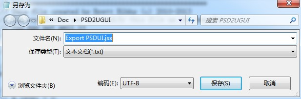
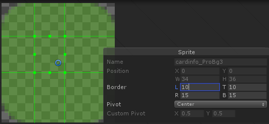
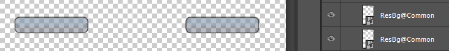
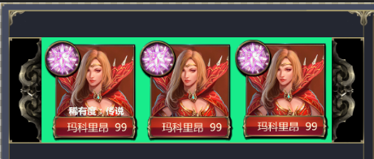
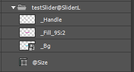
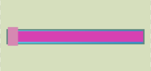
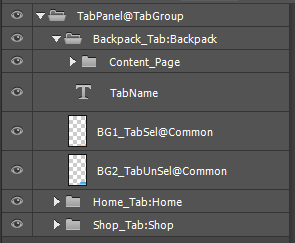

# 使用说明及命名规则

## 使用说明

1. 将脚本文件 Export PSDUI.jsx拷贝至“ps安装目录\Presets\Scripts”目录下，如：“E:\Program Files\PS\Adobe Photoshop CS6 (64 Bit)\Presets\Scripts”。注意先更新svn，如果脚本有修改，需要用最新的覆盖。
2. 打开一个psd文件，在ps中选择“文件->脚本->Export PSDUI”，会弹框选择一个目录，存放切图和配置文件即可。
3. 如果ps里面运行脚本时报错：javascript 代码丢失，或者运行时ps崩溃，解决方法：将Export PSDUI.jsx文件改成utf8格式编码（不是无BOM）。改文件编码方法：用记事本打开文件，文件--另存为，编码选择utf-8

    

## 注意事项

Psd文件的结构需要注意：最好是一个父图层组下面包含不同子图层组和图层，如图(注1)

如果是分散的结构，如图(注2)，执行脚本的时候可能会出现错误：“合并可见图层”当前不可用

 图注1</img>
 图注2</img>

## 命名关键字及说明：

关键字用来区分特定的控件，有特定功能。以符号“@”开始的关键字一般表示某类型控件，比如按钮Button，输入框InputField，滑动列表ScrollView等；以下划线“_”开始的关键字一般表示控件的某种功能，比如图层组Button下的图片带关键字“_Normal”表示这张图片是按钮的正常状态，“_Pressed”表示按下状态。
同一个图层会有多个关键字组合的情况。
为避免歧义，关键字统一大写开头。

- ### 文本（Text）
    _ArtStatic ：命名静态文本，这类文本会当做图片切图，导入unity时是一张图片
    _Static ：命名静态文本，这是unity相关的静态文本，不会切图，只是unity生成时会自动选择静态字体
    其他不带关键字：正常动态文本，unity生成时选择动态字体

- ### 图片
    _9S ：九宫格的图片，命名为_9S:XX（四个边界宽度一样）或_9S:XX:XX:XX:XX（左:上:右:下）的图会切成九宫格的图片。比如_9S:20会把图层切成左右上下都为20像素的九宫格图片。_9S:15:10:15:15会把图层切成左15，上10，右15，下15的九宫格图（如图）。

    

    _Texture ：大的图片用Texture，比如背景。对应UGUI的RawImage。
    _LeftHalf ：命名左右对称的图片，脚本会自动切左半部分。
    _BottomHalf ：命名上下对称的图片，脚本会自动切下半部分。
    _Quarter ：命名上下左右均对称的图片，脚本会自动切左下四分之一。

    @Common：命名同一个psd中多次用到的图，带该关键字以后只会切一张图。比如：

    

    @Global：命名多个psd中都用到过的图，带该关键字以后只会切一张图，且在unity中被多个界面引用。

- ### 按钮（Button）
    @Button ：按钮的结构如图：图层组上是按钮名字加关键字@Button

    

    _Normal ：命名按钮的背景，如果没有其他按下等效果，一张图片即可，如Test按钮。
    _Pressed ：按钮按下后的背景
    _HighLighted ：按钮高亮背景
    _Disabled ：按钮不可用时的背景
    注意点：Button组下不能再有组

- ### 滑动列表（ScrollView）
    @ScrollView ：标识一块滑动区域，结构如图：

    

    :H ：滑动方向为水平滑动
    :V ：滑动方向为垂直滑动
    @Size： 标识滑动区域的大小，可以随便用一张图，但是要保证这张图的尺寸完全覆盖滑动的区域，这张图不会切出来，且要放在ScrollView 组的最后面
    如图，绿色部分即为Size：

    

    :@LE ：自动布局元素，对应UGUI的LayoutElement。加该关键字后，滑动列表的子项(item)会自动布局

- ### 滑动条（Slider）
    @Slider：滑动条组件，可用作进度条，血条，音量调节条等。结构如图：

    

    :L ：标识滑动方向从左到右
    :R ：标识滑动方向从右到左
    :T ：标识滑动方向从上到下
    :B ：标识滑动方向从下到上
    @Size： 标识滑动区域的大小，可以随便用一张图，但是要保证这张图的尺寸完全覆盖滑动的区域，这张图不会切出来，且要放在Slider组的最后面
    _Bg ：滑动条背景图，可以用九宫格
    _Fill ：滑动条前景图，可以用九宫格
    _Handle ：滑动条的滑块，看情况添加，可以没有

- ### 开关选择（Toggle）
    @Toggle：标识开关或选择框，对应ugui的Toggle组件
    psd中结构如图：

    

    _Background：选择框的背景图
    _Checkmark：选择框的选中状态图
    对应示例：Assets\PSD2UGUI\Samples\toggle

- ### 页签（TabGroup）
    @TabGroup：页签组件（自定义），可方便地切换页签，点击时自动隐藏显示所控制的页面。该组件继承了ugui的ToggleGroup（TabGroup类）和Toggle（Tab类），TabGroup控制各个Tab的切换，Tab控制Page的隐藏显示。具体用法可见另一项目：https://github.com/zs9024/quick_tab
    psd中结构如图：

    

    _Tab：标识Tab组件，冒号“:”后面是该tab的标志符，会在生成prefab时赋值给tab的tag字段，该值在各个tab中不能相同（因为页签切换的时候总是只会显示一个）
    _Page：标识tab所控制的页面，页签中的具体内容都应放在这个图层组下面
    _TabSel：标识tab选中时的背景图
    _TabUnSel：标识tab未选中时的背景图
    对应示例：Assets\PSD2UGUI\Samples\tab

## 自定义导入器

使用CustomLayer特性，来添加注册自定义导入器

TODO
